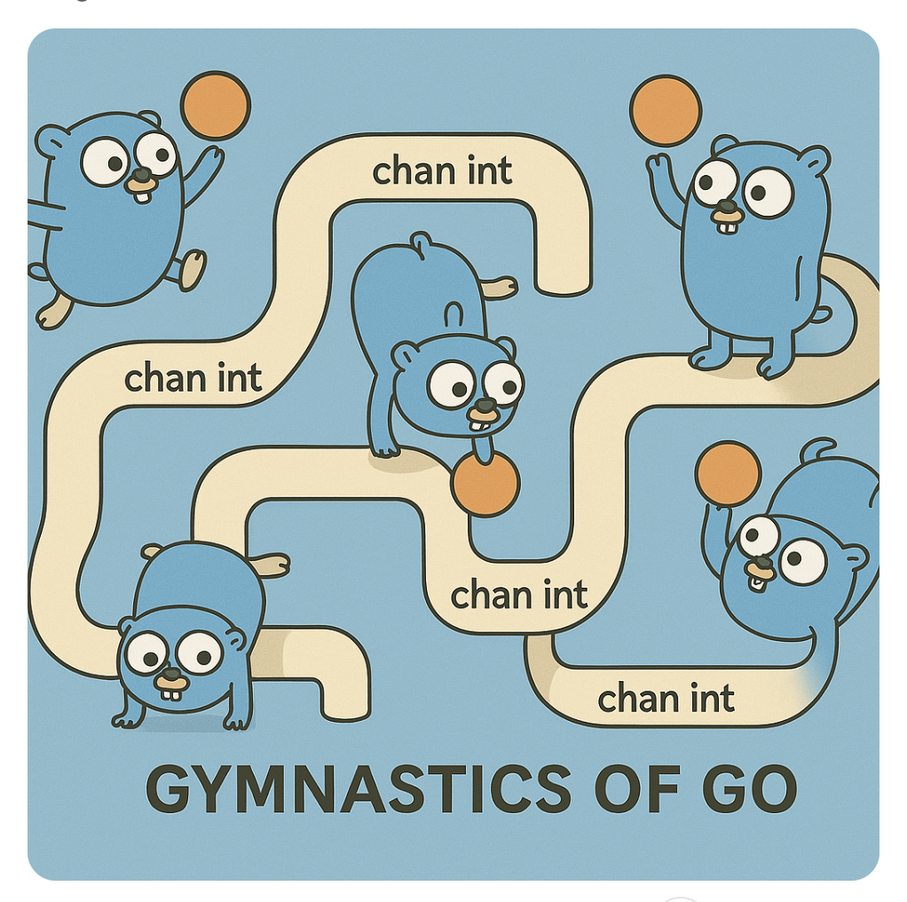
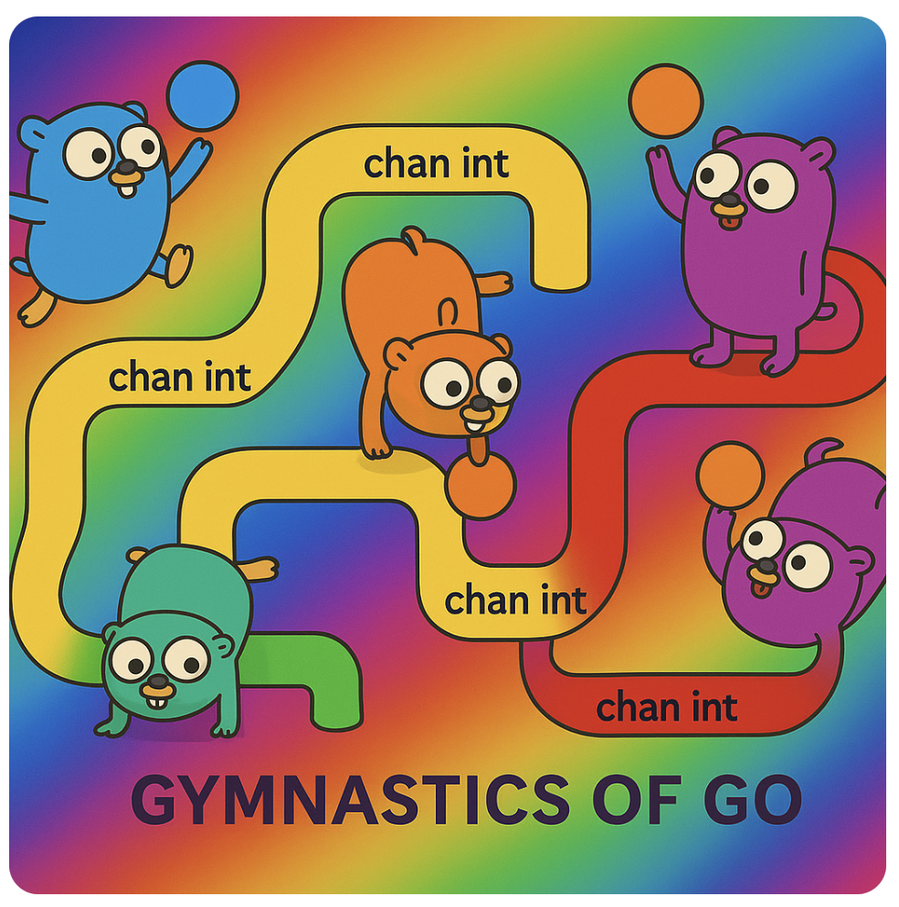

## Gymnastics of Golang

I am accumulating small but not-too-simple patterns and tricks in Golang while implementing RAFT in Go myself (the mkRaft project)~

Hope you like it, and if you like it I hope I can get a star! :star2: :star:

I :heart: Golang and I hope after this project I can start my RustGymnastics soon (:

### Not-Too-Simple Patterns of Golang

- **(2) Lazy Initialization with Concurrency**
    * learning the language first:
      - Go Basic Maps not safe concurrency, undefined [from this short but amazing blog](https://go.dev/blog/maps)
      - [sync.Map] (https://pkg.go.dev/sync#Map) which can be better than sync.Mutex/RWMutex+Go Map in cases
       > The Map type is optimized for two common use cases: 
       > (1) when the entry for a given key is only ever written once but read many times, as in caches that only grow, or 
       > (2) when multiple goroutines read, write, and overwrite entries for disjoint sets of keys. 
       > In these two cases, use of a Map may significantly reduce lock contention compared to a Go map paired with a separate Mutex or RWMutex.
    * the Pattern: check the code
    * where it is used: 
      - the Raft leader/candidate needs to send requests to peers for consensus
      - usually the clients to peers are created after the node is up or the nodes starting together will be in live lock

- **(1) Heartbeating Server**
    * building primitives:
      - Ticker v.s Timer (stop, reset, defer stop to prevent leaking)
      - Select, Channel (close, ok, buffered, len(), etc)
      - Context (explicit cancellation)
    * where it is used:
      - Raft Leader

### Tricks of Golang

1. Slices, Cases don't need initialization
   * Appending to a nil slice just allocates a new slice. So no need to initialize or check existence of a slice sometimes.
   * both range and len treat a nil slice as a zero-length slice

2. Maps, Exploiting Zero Values
   * When used as set, the value can be `m := make(map[*Node]bool)`, `notIn := m[k]` the zero value of the "value" which is false will be returned;
   * When used as 'map[some key][]some slice', we can append directly instead of checking the slice is initialized;

### Interesting Learning Materials

- [Special Control Flow of Golang: defer, panic, recover](https://go.dev/blog/defer-panic-and-recover)
- [Rob Pike's magic with Go channels](https://go.dev/talks/2012/concurrency.slide#20)
- [Go Blog: Concurrency Patterns, Fan-in/out, Pipeline, Cancellation](https://go.dev/blog/pipelines)
- [Go Blog: Memory Model](https://go.dev/ref/mem)
